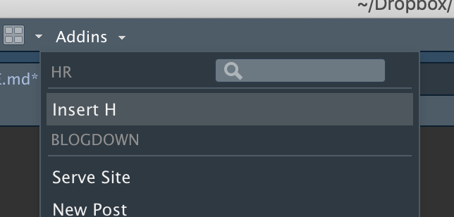
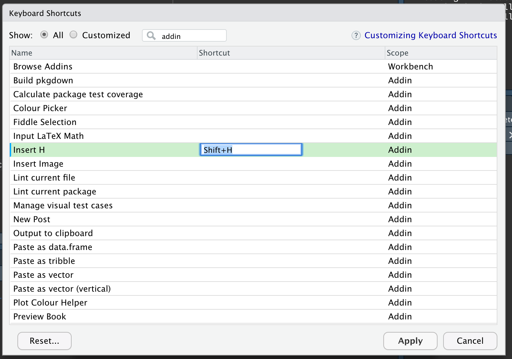

# Hr

<!-- badges: start -->
<!-- badges: end -->

The goal of Hr is to provide a native R binding to the tech tip provdied below:


All credit for the invention of this approach goes to [@Michael1979](https://twitter.com/Michael1979)

## Installation
This package will probably not be released on CRAN. It can be installed from
github using devtools:

``` r
# install.packages("devtools")
devtools::install_github('thomasp85/Hr')
```

## Example
After installation the Addins dropdown should contain an *Insert H* entry:



Simply click on this to insert an "H" at the current position of the cursor.

If you would like to use a shortcut, it is easy to add this by finding the addin 
in the keyboard shortcut menu and assign, say `Shift+h` to it. 



Now, every time 
you press `Shift` and  `h` at the same time, an uppercase h will get inserted at
the cursor position

## Roadmap

- It could be nice to cache the uppercase h character so that the wikipedia page
  was not downloaded and parsed every time
- Possible extension to handle other upper case letters

## Code of Conduct

Please note that the Hr project is released with a [Contributor Code of Conduct](https://contributor-covenant.org/version/1/0/0/). By contributing to this project, you agree to abide by its terms.
